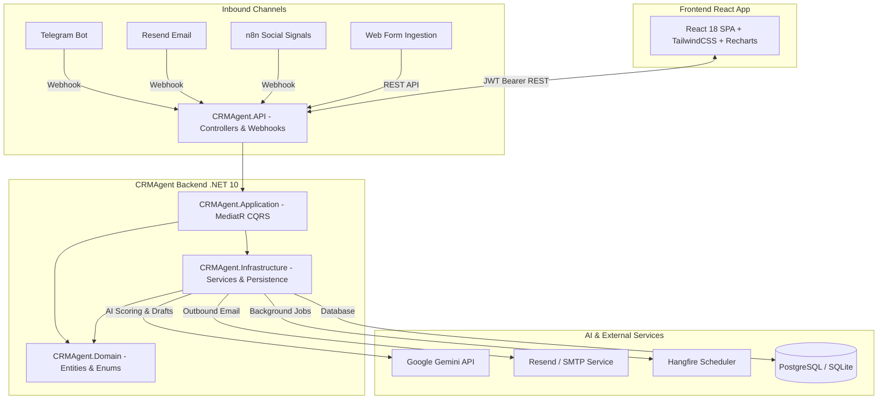

# 🚀 CRMAgent - Autonomous CRM & AI Lead Automation System


**CRMAgent** is a state-of-the-art, autonomous Customer Relationship Management (CRM) platform engineered with ASP.NET Core Clean Architecture and React. Powered by **Google Gemini AI**, CRMAgent automatically ingests, scores, tags, and drafts response emails for leads across multiple inbound channels (Telegram, Email, Social Media, and Web Forms), featuring a human-in-the-loop workflow for sales teams.

---

## 🌟 Key Features

### 🤖 AI-Driven Intelligence (Google Gemini Integration)
- **Automated Lead Ingestion & Scoring:** Instant evaluation of lead inquiry text with 0–10 scoring, emotion sentiment detection (e.g., *Urgent*, *Interested*, *Frustrated*), and summary generation.
- **Human-in-the-Loop Draft Approval:** AI automatically drafts customized email responses. Sales reps can review, edit inline, approve (sending instantly via Resend/SMTP), or reject drafts.
- **Dynamic AI Model Switching:** Seamlessly toggle between Gemini 3.6 Flash (high precision) and Gemini 3.5 Flash Lite via `dotnet user-secrets`.

### 📩 Multi-Channel Lead Ingestion & Tunnels
- **Telegram Bot Webhook (`/api/webhooks/telegram`):** Real-time conversation ingestion, auto lead creation, sender matching, and bi-directional message routing.
- **Inbound Email Webhook (`/api/webhooks/email`):** Direct inbound email parsing via Resend webhooks, header name/email extraction, and timeline activity logging.
- **n8n Social Media Automation (`/api/webhooks/social`):** Ingestion of social media engagement signals (Likes, Shares, Comments, Mentions, Follows) across LinkedIn, X/Twitter, Facebook, Instagram, and TikTok with sentiment analysis.

### 📋 Drag-and-Drop Kanban Pipeline
- **Interactive Deal Stages:** Move leads dynamically across pipeline stages: `New`, `Contacted`, `Qualified`, `ProposalSent`, `Negotiation`, `Won`, and `Lost`.
- **Optimistic UI Updates:** Powered by `@dnd-kit` for responsive drag-and-drop interactions with background synchronization and fallback rollback.

### 📊 Deep Analytics & Visualization
- **Interactive Dashboards:** Visualized with `Recharts` providing donut/pie charts, stacked bar charts, and channel conversion breakdowns.
- **Social Media Sentiment Widgets:** Real-time metrics for platform volume, social sentiment breakdown, and engagement type categorization.
- **Automated AI Insights:** Strategic recommendations based on channel acquisition rates and high-intent lead scores.

### ⏰ Background Processing & Stagnant Lead Detection
- **Hangfire Scheduler:** Automated jobs (e.g., `DailyPipelineCheckJob`) identifying stagnant or at-risk leads and triggering automated reminder follow-ups.
- **Schedule & Calendar View:** Integrated sales activity timeline and daily tasks.

### 🔐 Security & Role-Based Access Control (RBAC)
- **ASP.NET Core Identity & JWT Authentication:** Secure bearer token auth with automatic header injection.
- **Granular Roles:** `Admin`, `SalesRep`, `SocialMediaRep`, and `Manager`.

---

## 🏗 System Architecture



---

## 📁 Repository Structure

```text
CRMAgent/
├── Dockerfile                  # Container definition for ASP.NET Core API
├── CRMAgent.sln                # Visual Studio Solution File
├── docs/                       # Detailed Architecture & Module Documentation
│   ├── CONTRACTS.md            # API Request/Response Data Contracts
│   ├── MODULE_CHANNELS.md     # Telegram, Email & Webhook Specifications
│   ├── MODULE_FRONTEND.md     # React Pages, Components & State Setup
│   ├── MODULE_LEADS.md        # Lead Ingestion Domain Rules & Services
│   └── MODULE_SETUP.md        # Setup Guide & Environment Configurations
└── src/
    ├── CRMAgent.API/           # Web API, Controllers, Webhooks & Host
    │   └── ClientApp/          # React SPA Frontend (Tailwind, Recharts, Lucide)
    ├── CRMAgent.Application/   # CQRS Use Cases, Commands, Queries, Handlers
    ├── CRMAgent.Domain/        # Domain Entities (Lead, Interaction, EmailDraft, ActivityLog)
    └── CRMAgent.Infrastructure/# Gemini AI, Repositories, DbContext, Webhook Handlers
```

---

## 🚀 Getting Started

### Prerequisites
- **.NET 10 SDK** (or .NET 8/9 compatible runtime)
- **Node.js 18+** & `npm`
- **Docker Desktop** (optional, for containerized run)
- **Google Gemini API Key** (for AI scoring & email draft generation)

---

### Option A: Running with Docker Compose (Recommended)

Run the backend API, PostgreSQL, React Frontend, and n8n automatically:

```bash
docker compose up -d --build
```

- **React Frontend:** `http://localhost:3000`
- **Backend API (Swagger):** `http://localhost:5087/swagger`
- **n8n Automation:** `http://localhost:5678`

---

### Option B: Manual Local Setup

#### 1. Backend Setup (.NET 10 API)
Navigate to the API folder and run the server:

```bash
cd src/CRMAgent.API
dotnet restore
dotnet run
```
- Swagger UI will open at `http://localhost:5087/swagger` (or `https://localhost:7001/swagger`).
- **Default Seed Admin:** `admin@crm.com` / `Admin123!`

#### 2. Frontend Setup (React App)
Open a separate terminal window:

```bash
cd src/CRMAgent.API/ClientApp
npm install
npm start
```
- Frontend starts at `http://localhost:3000`.
- Sign in with the admin credentials above.

#### 3. n8n Social Automation (Optional)
Run n8n in Docker to forward social engagement webhooks:

```bash
docker run -it --rm --name n8n -p 5678:5678 -v %USERPROFILE%\.n8n:/home/node/.n8n n8nio/n8n
```

---

## 🔑 Environment & Secret Configuration

### Backend (`appsettings.json` / User Secrets)
Configure your Gemini API key and email settings in `src/CRMAgent.API`:

```json
{
  "GeminiSettings": {
    "ApiKey": "YOUR_GEMINI_API_KEY",
    "ModelEndpoint": "https://generativelanguage.googleapis.com/v1beta/models/gemini-3.6-flash:generateContent"
  },
  "ResendSettings": {
    "ApiKey": "YOUR_RESEND_API_KEY",
    "FromEmail": "crm@yourdomain.com"
  },
  "Jwt": {
    "Secret": "SUPER_SECRET_JWT_KEY_AT_LEAST_32_CHARS_LONG",
    "Issuer": "CRMAgentAPI",
    "Audience": "CRMAgentClient"
  }
}
```

### Switching Gemini Models
Easily change Gemini AI models via CLI:

- **Switch to Gemini 3.5 Flash Lite:**
  ```bash
  dotnet user-secrets set "GeminiSettings:ModelEndpoint" "https://generativelanguage.googleapis.com/v1beta/models/gemini-3.5-flash-lite:generateContent" --project src/CRMAgent.API
  ```
- **Switch to Gemini 3.6 Flash (Default):**
  ```bash
  dotnet user-secrets set "GeminiSettings:ModelEndpoint" "https://generativelanguage.googleapis.com/v1beta/models/gemini-3.6-flash:generateContent" --project src/CRMAgent.API
  ```

---

## 🌐 Local Webhook Tunneling (Ngrok / Serveo)

To test Telegram or Resend webhooks on your local machine (`localhost:5087`), expose your port with a public URL:

### Ngrok (Recommended)
```bash
.\ngrok http 5087 --domain=your-domain.ngrok-free.dev
```

### Register Telegram Webhook
```text
https://api.telegram.org/bot<YOUR_BOT_TOKEN>/setWebhook?url=https://<YOUR_TUNNEL_URL>/api/webhooks/telegram
```

### Register Resend Inbound Email Webhook
Point your Resend.com Webhook URL to: `https://<YOUR_TUNNEL_URL>/api/webhooks/email`

---

## 🛡 Roles & Access Control

| Role | Permissions |
| :--- | :--- |
| **Admin** | Full system access, delete leads, configure workflows & users |
| **Manager** | View all leads, reports, analytics, performance dashboards |
| **SalesRep** | Manage assigned leads, Kanban pipeline, review/approve AI drafts |
| **SocialMediaRep** | Monitor social channels, activity logs, social sentiment feeds |

---

## 📜 Documentation Index

For deeper dive into module-specific architectures, check the `docs/` folder:
- [MODULE_SETUP.md](docs/MODULE_SETUP.md) – Running options, secrets, and tunnel configurations.
- [MODULE_FRONTEND.md](docs/MODULE_FRONTEND.md) – Detailed React pages, components, and state details.
- [MODULE_LEADS.md](docs/MODULE_LEADS.md) – Lead scoring logic, entity relations, and API specs.
- [MODULE_CHANNELS.md](docs/MODULE_CHANNELS.md) – Inbound Telegram, Resend, and n8n webhook setup.
- [CONTRACTS.md](docs/CONTRACTS.md) – REST contracts and DTO schema specs.

---

## 📄 License
This project is licensed under the MIT License - see the LICENSE file for details.
